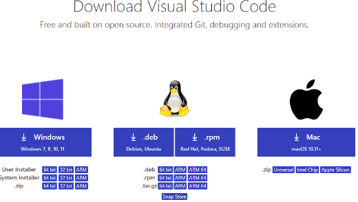
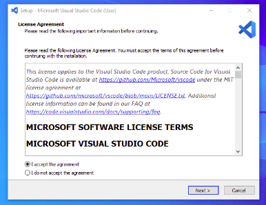
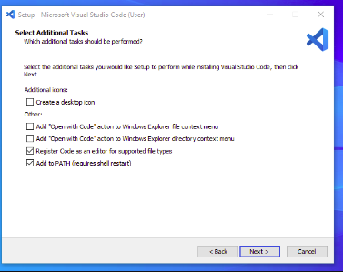
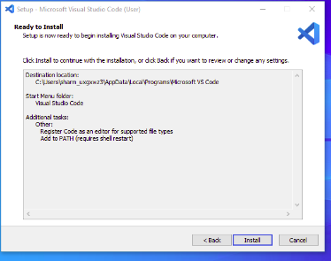
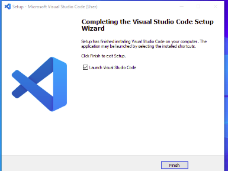

# SE-Assignment-5
Installation and Navigation of Visual Studio Code (VS Code)
 Instructions:
Answer the following questions based on your understanding of the installation and navigation of Visual Studio Code (VS Code). Provide detailed explanations and examples where appropriate.

 Questions:

1. Installation of VS Code:
   - Describe the steps to download and install Visual Studio Code on Windows 11 operating system. Include any prerequisites that might be needed.

2. First-time Setup:
   - After installing VS Code, what initial configurations and settings should be adjusted for an optimal coding environment? Mention any important settings or extensions.

3. User Interface Overview:
   - Explain the main components of the VS Code user interface. Identify and describe the purpose of the Activity Bar, Side Bar, Editor Group, and Status Bar.

4. Command Palette:
   - What is the Command Palette in VS Code, and how can it be accessed? Provide examples of common tasks that can be performed using the Command Palette.

5. Extensions in VS Code:
   - Discuss the role of extensions in VS Code. How can users find, install, and manage extensions? Provide examples of essential extensions for web development.

6. Integrated Terminal:
   - Describe how to open and use the integrated terminal in VS Code. What are the advantages of using the integrated terminal compared to an external terminal?

7. File and Folder Management:
   - Explain how to create, open, and manage files and folders in VS Code. How can users navigate between different files and directories efficiently?

8. Settings and Preferences:
   - Where can users find and customize settings in VS Code? Provide examples of how to change the theme, font size, and keybindings.

9. Debugging in VS Code:
   - Outline the steps to set up and start debugging a simple program in VS Code. What are some key debugging features available in VS Code?

10. Using Source Control:
    - How can users integrate Git with VS Code for version control? Describe the process of initializing a repository, making commits, and pushing changes to GitHub.

 Submission Guidelines:
- Your answers should be well-structured, concise, and to the point.
- Provide screenshots or step-by-step instructions where applicable.
- Cite any references or sources you use in your answers.
- Submit your completed assignment by 1st July 

## Answers

# VS Code Setup and Usage Guide

## 1. Installation of VS Code

### Steps to Download and Install Visual Studio Code on Windows 11

**Step 1: Download Visual Studio Code**
   - Visit the [Visual Studio Code download page](https://code.visualstudio.com/Download).
   - Select "Download for Windows."

   

**Step 2: Run the Installer**
   - Locate the downloaded installer in your Downloads folder.
   - Double-click the installer to start the installation process.

**Step 3: Accept the Agreement**
   - Read and accept the terms and conditions by clicking "I accept the agreement."
   - Click "Next."

   

**Step 4: Choose Install Location**
   - Choose the installation location or leave it at the default setting.
   - Click "Next."

   

**Step 5: Select Additional Tasks**
   - Check any additional tasks you want the installer to perform, such as adding a shortcut to the desktop.
   - Click "Next."

**Step 6: Install Visual Studio Code**
   - Click "Install" to begin the installation.

   

**Step 7: Complete Installation**
   - Once the installation is complete, click "Finish."

   

## 2. First-time Setup

### Initial Configurations and Settings

**Extensions to Install:**
   - **Python**: For Python development.
   - **Prettier - Code formatter**: For code formatting.
   - **ESLint**: For JavaScript linting.
   - **GitLens**: For enhanced Git capabilities.

**Settings to Adjust:**
   - Open settings by clicking the gear icon in the bottom left and selecting "Settings."
   - Set the theme: Search for "Color Theme" and choose your preferred theme.
   - Configure Auto Save: Search for "Auto Save" and enable it.

## 3. User Interface Overview

**Main Components of the VS Code UI:**

**Activity Bar:**
   - Located on the far left. Provides access to core functionalities like Explorer, Search, Source Control, Run & Debug, and Extensions.

**Side Bar:**
   - Displays different views such as the file explorer or source control.

**Editor Group:**
   - The main area where you edit your files. You can open multiple files in tabs.

**Status Bar:**
   - Located at the bottom. Shows information about the opened file and the current state of the editor.

## 4. Command Palette

**What is the Command Palette?**
   - The Command Palette allows you to access all commands in VS Code.

**How to Access:**
   - Press `Ctrl+Shift+P` (or `Cmd+Shift+P` on Mac).

**Common Tasks:**
   - Change the color theme: Type "color theme" and select the desired theme.
   - Install extensions: Type "install extensions" and select the desired extension.

## 5. Extensions in VS Code

**Role of Extensions:**
   - Extensions enhance the functionality of VS Code by adding support for languages, debuggers, and tools.

**Finding and Installing Extensions:**
   - Click the Extensions icon in the Activity Bar.
   - Search for the extension you need and click "Install."

**Managing Extensions:**
   - Manage installed extensions by clicking the gear icon next to an extension in the Extensions view.

**Essential Extensions for Web Development:**
   - **HTML Snippets**
   - **CSS IntelliSense**
   - **JavaScript (ES6) code snippets**
   - **Live Server**

## 6. Integrated Terminal

**How to Open:**
   - Open the terminal by selecting `View > Terminal` or pressing `Ctrl+` (or `Cmd+` on Mac).

**Advantages:**
   - Run terminal commands without leaving the editor.
   - Easily navigate and execute commands within the context of your project.

## 7. File and Folder Management

**Creating and Opening Files:**
   - Right-click in the Explorer view and select "New File" or "New Folder."
   - Open files by double-clicking them in the Explorer view.

**Navigating Between Files:**
   - Use `Ctrl+P` (or `Cmd+P` on Mac) to quickly open files by name.

## 8. Settings and Preferences

**Customizing Settings:**
   - Open settings by clicking the gear icon and selecting "Settings."
   - Change theme: Search "Color Theme" and choose a theme.
   - Adjust font size: Search "Font Size" and set your preferred size.
   - Modify keybindings: Search "Keyboard Shortcuts" and customize as needed.

## 9. Debugging in VS Code

**Setting Up Debugging:**
   - Open the Run and Debug view by clicking the play icon in the Activity Bar.
   - Click "Create a launch.json file" and select your environment (e.g., Python).

**Starting Debugging:**
   - Set breakpoints by clicking in the gutter next to the line numbers.
   - Click the green play button to start debugging.

**Key Debugging Features:**
   - Step over, step into, and step out of code.
   - Watch variables and inspect the call stack.

## 10. Using Source Control

**Integrating Git with VS Code:**
   - Open the Source Control view by clicking the branch icon in the Activity Bar.
   - Click "Initialize Repository" to set up a new Git repository.

**Making Commits:**
   - Stage changes by clicking the `+` icon next to changed files.
   - Enter a commit message and click the checkmark icon to commit.

**Pushing Changes to GitHub:**
   - Click the ellipsis `...` in the Source Control view.
   - Select "Push" to upload your commits to GitHub.